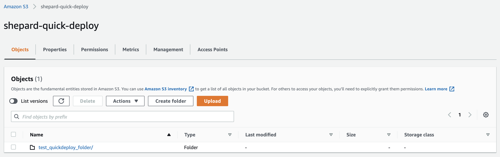
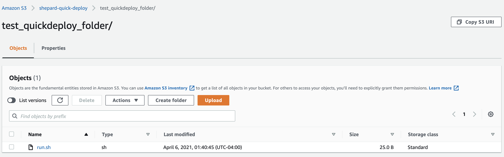
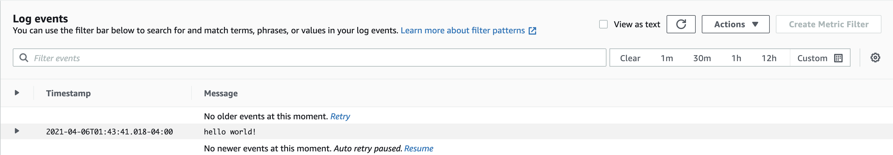

# Shepard

## Introduction

Shepard is a one-stop shop to turn a container into a highly scalable easy to manage workflow in AWS. It is a machine that makes machines that execute your code. For more background on the project and some of its aims feel free to look through the following link on the GinkgoBits blog from June of 2020 about the project: https://www.ginkgobioworks.com/2020/06/15/shepard-automating-the-creation-of-batch-processing-workflows-in-aws/.

Shepard is a CloudFormation template and an accompanying custom made CLI. The Shepard architecture allows for automatic, scalable and easy execution of arbitrary container code for batch workflows. Running in a standard account with no other lambdas in it the architecture can turn over 17,500 uploads to an S3 bucket into batch jobs a minute and can queue to over 120,000 jobs simultaneously at any one time. This means it takes a little over 57 minutes to turn 1,000,000 uploads into AWS batch jobs. It provides options to create AWS EFS and/or high-performance AWS Lustre file systems and automount them to worker containers and has options to securely store and interact with authentication tokens and other sensitive cryptomatter stored in AWS Secrets Manager. It comes with a command line interface that allows users (among other things) to easily batch out jobs, deploy new code, query existing jobs and deploy authentication files and cryptomatter to secrets manager each with a single command. It also comes pre-built with an AWS lambda that you can use to batch out jobs even faster than you can with S3 uploads. 

A whole architecture can be built or deleted in under a half hour. You can build architectures in parallel at the same time in AWS with CloudFormation. The CloudFormation template it uses is self-contained, so it requires no external dependencies like lambda code or layers to be stored in S3 buckets. Moreover, the part of the architecture that stores container code actually builds first so sometimes I trigger a code deployment immediately after starting a build process on an architecture and then by the time the architecture is done building in CloudFormation I can immediately begin processing jobs. I’ve set up many fully completed functioning architectures in as little as 20 minutes.

Also because Shepard runs using docker-in-docker and has an option to pass the docker daemon to a user provided payload container you can actually write containerized workflows that use docker provided you configure your location container! This allows for the making of containers that can pull containers for use in analyses and containers that can build other containers.

## Project History


Shepard was designed and created by myself, Jacob Mevorach (https://www.linkedin.com/in/jacob-mevorach-27166a159), for Ginkgo Bioworks during a ~2 month period in 2020. The goal at the outset of the project was to fill what I saw as a need to quickly scale analyses that scientists were working on.

.jpg)

(Source: https://commons.wikimedia.org/wiki/File:Alan_Shepard_Apollo_14_(cropped).jpg

The project is named after Alan Shepard who was the first American to travel into space. It was also named as a jab to Rancher which is a program that I've spent a lot of time supporting. Rancher is a program that manages "herds" of "cattle" while Shepard manages "flocks" of "sheep". A "flock" is technically the term used for an instance of a Shepard architecture and a "sheep" is an instance running within that "flock". Keep in mind I will use "instance" and "sheep" interchangeably and will also use "flock" and "instance of an architecture" interchangeably going forward in the rest of the documentation.


A job is started when a formatted dataset is uploaded to the Shepard S3 trigger bucket. A formatted dataset is a zip that contains (at a minimum) a file called inputs.txt that contains a json that specifies as many or as few key value pairs as the user would like. These input key value pairs will become available to a worker containers as environment variables when it runs later. The initial input zip also will be available to a worker container later on as well. Input zips can be up to 2^32 bytes in size (beyond this zips are typically compressed as zip64 rather than using standard zip compression which breaks some bit level reading that Shepard does although support for zip64 may be added in a later release). Having said that input zips can be no larger than 2^32 bytes in size there are a number of ways to deal with and process datasets that are larger for a single job (i.e. EFS, S3, etc. etc.). 

This upload to S3 triggers an SQS message to be sent to an SQS queue. The SQS queue is consumed by a processing lambda which initializes a row in an authoritative state DynamoDB that self-cleans itself of rows for completed jobs as jobs complete and, among other things, provides variables for command line inputs and auto-updating variables for things like job state. The processing lambda also creates a Batch job and can resubmit an event to the SQS queue if a batch endpoint rejects a job due to being overwhelmed by API calls. If a poison-pill message can’t be handled by the lambda job scheduler it is moved to a dead letter queue for error analysis.

It also has a Lambda endpoint that can be used to batch out jobs if you would like to be able to batch out jobs faster than you could via S3 uploads.

Shepard can run any variety of container and does so on a managed batch fleet of spot or dedicated EC2 instances (you get to pick which of these you want in the dropdown menu when you build the CloudFormation for Shepard) and it takes inputs from an S3 bucket and deposits outputs to another S3 bucket automatically.

It also uses a secrets manager store to securely reconstitute authorization files and tokens at run time and communicates with the authoritative state DynamoDB to update job metadata variables in real time and injects user specified environment variables into containerized workflows. In the event of a crash Shepard also automatically deposits a zip with error log data into a log S3 bucket. 

## Getting Started Guide

So you want to get started with Shepard? Great. The process can be roughly boiled down to the following steps each of which will have their own section later on in this guide.

1. Run the Cloudformation
1. Configure the CLI
1. Write Your Code
1. Deploy Your Code
1. Deploy Your Secrets (if you have any)
1. Run Your Code
1. Collect Your Results (if you have any) 

## Run the Cloudformation

The Cloudformation we're going to run to set up a Shepard architecture instance can be found in the "cloudformation" folder in this repo. It's contained in a file called "shepard.yml". The Cloudformation template for Shepard requires no external dependencies and is all you need to get started with making the architecture.

For the sake of brevity I'm going to assume you're familiar with running Cloudformation templates but if you're not I'd like to point you at the following documentation that AWS provides: https://docs.aws.amazon.com/AWSCloudFormation/latest/UserGuide/stacks.html. For the rest of this section we're going to go through what the different parameters in the Template mean and how changing them will effect the architecture produced in your AWS account. You fill out the template with each of these parameters and then you press go and if everything builds successfully you're good to go on to the next step. Without further ado here are the parameters ...

**S3 Parameters**
  * <ins>InputsBucket</ins> - This is the name of the S3 bucket with which you can trigger Shepard jobs by dropping properly formatted S3 zip files into. We will get into what constitutes a properly formatted zip file later on in the documentation but for brevity we will describe it here as a zip that, at a minimum, contains a text file named "inputs.txt" that contains json describing what you'd like to become environment variables for that specific job. This also corresponds to the "shepard_cli_s3_bucket_to_upload_to" attribute when you run the "configure" command using the Shepard CLI.
  * <ins>OutputsBucket</ins> - This is the name of the S3 bucket that will store outputs from jobs from the architecture written to the output locations. This also corresponds to the "shepard_cli_s3_bucket_for_results" attribute when you run the "configure" command using the Shepard CLI.
  * <ins>ErrorsBucket</ins> - This is the name of the S3 bucket to which jobs will deposit zip files containing log files in the event a container being run throws a fatal error.

**DynamoDB Parameters**
  * <ins>TableName</ins> - The name of the DynamoDB that will get made for use with the architecture for storing attributes (including real-time autoupdating attributes) for jobs. This also corresponds to the "shepard_cli_dynamo_db_to_query" attribute when you run the "configure" command using the Shepard CLI.

**Secrets Manager Parameters**
  * <ins>SecretsManagerName</ins> - The name of the secrets manager secrets instance that will get made for use along with the rest of the architecture. Secrets stored here as key value pairs where the key is the name of a file and the value is a base64 string representation of a file will be securely reconstituted for use at runtime by containers running your jobs. You can populate this with files in a directory using the Shepard CLI "secretify" command. This also corresponds to the "shepard_cli_secret_store" attribute when you run the "configure" command using the Shepard CLI.

**Batch Parameters**
  * <ins>BatchInstanceNames</ins> - This is the name that will be given to batch instances running as part of the flock.
  * <ins>DesiredRam</ins> - This is the amount of RAM you'd like each of your jobs running in AWS Batch to use in CPU cores.
  * <ins>DesiredCPU</ins> - This is the amount of CPU you'd like each of your jobs running in AWS Batch to use in MiB.
  * <ins>MaxCPU</ins> - This is the maximum amount of CPU cores you'd ever want to be allowed to run in the batch environment at one time. By default this is set very high but if you'd like to limit throughput lowering it might not be a bad idea.
  * <ins>InstanceTypes</ins> - The instance types you'd like to run your jobs as a comma delimited list.
  * <ins>LaunchTemplateName</ins> - The name you'd like to give to the launch template associated with this flock.
  * <ins>ComputeEnvironmentType</ins> - You get to choose from a dropdown between "Ec2" and "Spot". Selecting "Spot" will cause the instances running your jobs to be AWS "Spot" instances which can result in potential cost savings while "Ec2" will cause the instances running your jobs to be normal on-demand instances which are generally (but not always) more expensive than "Spot" instances.
  * <ins>QueueName</ins> - The name given to the AWS Batch job queue associated with this flock.
  * <ins>JobDefinitionName</ins> - The name given to the AWS Batch job definition associated wit this flock.
  * <ins>Ec2KeyPair</ins> - Here you select from a dropdown of all the key pairs available in your account what SSH key you'd like to use to be able to SSH into instances. You must select an option here even if you don't plan on setting up your instances for you to be able to SSH into.
  * <ins>DefaultCapacity</ins> - This is a parameter where you can specify the amount of CPU cores you'd want by default always running in your batch environment waiting for jobs to come in. Keep in mind these cores will run even if there are no jobs but it might help in situations where you always want quick turnaround on some amount of jobs and don't want to wait for spin up times which can vary depending on a number of factors.
  * <ins>UlimitsNoFilesOpen</ins> - Changing this number allows you to modify the amount of files that can be opened by all the containers running on an instance at one time simultaneously. Right now it's set to the maximum I found I could make it of 1048576 (1024^2) but you should be able to lower it if you desire. That said making it higher than this number will generally cause errors.

**Instance Tagging Parameters**
  * <ins>ProjectName</ins> - This value will be set as a value for a "Project" tag that will be affixed to all instances running in this flock.
  * <ins>TeamName</ins> - This value will be set as a value for a "Team" tag that will be affixed to all instances running in this flock.
  * <ins>ContactEmail</ins> - This value will be set as a value for a "Contact" tag that will be affixed to all instances running in this flock. It's by default set to it@ginkgobioworks.com but I'd change that because I definitely wouldn't want to be contacted for non-Ginkgo stuff at my work email.
  * <ins>WorkloadValue</ins>  - This value will be set as a value for a "WorkloadType" tag that will be affixed to all instances running in this flock.

**ECR Parameters**
  * <ins>ECRRepoName</ins> - The name given to the ECR repo associated with this flock. To deploy new code you push a new container. A Shepard compatible container can be pushed to ECR in one command using the "deploy" command in the Shepard CLI. This corresponds to the 'shepard_cli_ecr_repo_to_push_to' attribute when you run the "configure" command using the Shepard CLI. This also corresponds to the "shepard_cli_ecr_repo_to_push_to" attribute when you run the "configure" command using the Shepard CLI.

**EFS Parameters**
  * <ins>EFSName</ins> - The name given to an EFS filesystem associated with this flock should you decide to request one for use with the flock.
  * <ins>EFSThroughput</ins> - The throughput of an EFS filesystem associated with this flock should you decide to request one for use with the flock.

**Lustre Parameters**
  * <ins>LustreName</ins> - The name given to a Lustre filesystem associated with this flock should you decide to request one for use with the flock.
  * <ins>LustreBucketName</ins>  - The name given to an S3 bucket associated with a Lustre filesystem should you decide to request a Lustre filesystem for use with the flock. To be clear this will be the name of an S3 bucket that the Cloudformation will create if you choose to request a Lustre filesystem for the flock unless you specify that you'd like to use a preexisting bucket.
  * <ins>LustreStorageCapacity</ins> - A number in GiB you'd like for storage on your Lustre file system. Must be an integer. Valid values are 1.2 TiB, 2.4 TiB, and increments of 2.4 TiB.

**EBS Volume Parameters**
  * <ins>SizeOfRootDisk</ins> - An integer specifying the number of GiB you'd like for the encrypted EBS volume that will be used to backend the root disk for the EC2 instances that will run your batch jobs. By default AWS Batch makes this 22 GiB but you can make it arbitrarily large (while not exceeding the limits for EBS volumes in launch templates general). If you choose to be able to toggle the default EBS volume sizes for Batch instances to this size by setting "ToggleVariableEBSVolumeSizes" to "True" in the Cloudformation this number must be at least 22 GiB. 
  * <ins>SizeOfContainerStorageDisk</ins> - An integer specifying the number of GiB you'd like for the encrypted EBS volume that will be used to backend the storage of containers for the EC2 instances that will run your batch jobs. By default AWS Batch makes this 8 GiB but you can make it arbitrarily large (while not exceeding the limits for EBS volumes in launch templates general). If you choose to be able to toggle the default EBS volume sizes for Batch instances to this size by setting "ToggleVariableEBSVolumeSizes" to "True" in the Cloudformation this number must be at least 22 GiB. 

**SQS Parameters**
  * <ins>SQSName</ins> - The name of the SQS queue that will hold events resulting from S3 uploads to the Shepard trigger bucket.

**Lambda Parameters**
  * <ins>LambdaMemorySize</ins> - This is the RAM in MiB allocated to the Lambda that's used to process s3 uploads into Batch jobs by Shepard. This is by default set to the lowest possible value of 128 MiB and to be honest it probably doesn't ever need to get raised for any reason. You *might* get *slight* speed improvements if you raise this but I doubt they would be relevant event if they occurred in 99.999..% of workflows you'd be running. So if you'd like to pay more money for what probably will be no improvement to you feel free to raise this number.
  * <ins>DaysToKeepFailedLaunchIndexes</ins> - The DynamoDB that stores updating attributes for Shepard apps is self cleaning in that when jobs finish they will change the TTL (time to live) for the indexes associated with those jobs to the present time causing them to be deleted. If a job dies before it gets a chance to adjust the TTL there's a default TTL that's set by the Lambda that batches out jobs from S3 jobs and this number is an integer that determines how many days those indexes will be kept before they're deleted. The whole idea behind this parameter is to give you time to check things for error handling if necessary but also to save you money by not having you store failed job indexes in a DynamoDB forever. 

**Toggle Parameters**
  * <ins>ToggleEFS</ins> - If you set this to "True" an EFS file system will be spun up for use with your flock. If you set this to "False" an EFS file system will not be created for use with your flock.
  * <ins>ToggleLustre</ins> - If you set this to "True" a Lustre file system will be spun up for use with your flock. If you set this to "False" a Lustre file system will not be created for use with your flock.
  * <ins>ToggleVariableEBSVolumeSizes</ins> - If you set this to "True" you will be allowed to change the sizes of the EBS volumes associated with the instances in your batch environment specified by the "SizeOfRootDisk" and "SizeOfContainerStorageDisk" parameters set in the cloudformation.
  * <ins>ToggleUseExistingBucketForLustre</ins> -If you set this to "True" and you request a Lustre filesystem for use with this flock the Cloudformation will not attempt to make a new S3 bucket for use with the filesystem but will instead look for an already existing S3 bucket with the name specified in the "LustreBucketName" parameter. The cool thing about this is that if there are any files or objects located in said S3 bucket they will be automatically imported into your Lustre filesystem when it spins up. This makes this a potentially very useful option.
  * <ins>ToggleAllowAccessToDockerDaemon</ins> - If you set this to "True" the worker docker container will pass the docker daemon located at /var/run/docker.sock as a volume mount to the payload container located at /var/run/docker.sock. This will allow the container, if configured properly, to use the host docker daemon for functions. This means if your payload container was a docker-in-docker container, for instance, that you'd be able to actually have Shepard jobs that performed docker functions. This means you could pull docker repos to do computations with or even, if you stored credentials for instance in the secrets manager instance that comes with your flock, perform docker builds and push to ECR or another docker repo. This should not be set to "True" for untrusted containerized workloads as allowing access to the docker daemon is a potential security issue if you don't trust the underlying workload you're running.
  * <ins>ToggleAllocationStrategy</ins> - True for on; False for off. If you select a "SPOT" batch compute enviroment setting this toggle to True will select the "SPOT_CAPACITY_OPTIMIZED" allocation strategy. If you select a "ON DEMAND" (i.e. setting the "ComputeEnvironmentType" parameter in this cloudformation to "Ec2")  batch compute enviroment setting this toggle to True will select the "BEST_FIT_PROGRESSIVE" allocation strategy. Making this toggle False will make it so that all batch environments (On-Demand or Spot) will be spun up with the "BEST_FIT" allocation strategy. You can read more about different allocation strategies here (https://docs.aws.amazon.com/batch/latest/userguide/allocation-strategies.html) but the short of it is I'd recommend leaving this set to True unless you're very concerned about keeping costs down and are willing to sacrifice better scaling in favor of lower costs.

**Extra IAM Policy Parameters**
  * <ins>ToggleIncludeExtraIAMPolicyForContainerRole</ins> - If True will attach the IAM policy ARN referred to in "ExtraIAMPolicyForContainerRole" to the container role for jobs associated with this architecture. This toggle can be used to grant extra permissions to a Shepard architecture's jobs (i.e. its containers) beyond those that are normally granted. This allows you to specify your own IAM policy and apply it.
  * <ins>ExtraIAMPolicyForContainerRole</ins> - Extra IAM policy that will be attached if "ToggleIncludeExtraIAMPolicyForContainerRole" is set to True. Can be ignored if "ToggleIncludeExtraIAMPolicyForContainerRole" is set to False.

**Networking Parameters**
  * <ins>EnvironmentName</ins> - A name that will be prefixed to network resource names for this flock.
  * <ins>VpcCIDR</ins> - The CIDR that will be given to the VPC that this flock will be put into.
  * <ins>PublicSubnet1CIDR</ins> - A CIDR representing a subset of I.P. addresses specified in the VpcCIDR that will be accessible to the public subnet created in the first availability zone of the region you build the cloudformation in.
  * <ins>PublicSubnet2CIDR</ins> - A CIDR representing a subset of I.P. addresses specified in the VpcCIDR that will be accessible to the public subnet created in the second availability zone of the region you build the cloudformation in.
  * <ins>PrivateSubnet3CIDR</ins> - A CIDR representing a subset of I.P. addresses specified in the VpcCIDR that will be accessible to the private subnet created in the first availability zone of the region you build the cloudformation in.
  * <ins>PrivateSubnet4CIDR</ins> - A CIDR representing a subset of I.P. addresses specified in the VpcCIDR that will be accessible to the private subnet created in the second availability zone of the region you build the cloudformation in.
  * <ins>CIDRToAllowSSHAccessTo</ins> - A CIDR representing I.P. addresses you would like to allow SSH access to your instances to.
  * <ins>AllowSSHAccessToCIDRToAllowSSHAccessTo</ins> - If you set this to "True" the CIDR specified in the "CIDRToAllowSSHAccessTo" parameter will be granted access to SSH into instances running your jobs on port 22.
  * <ins>MakeSubnetsPublic</ins> - If you set this to "True" your instances running jobs will be spun up in the public subnets of this flock where they will get public I.P. addresses mapped to them whereas if you set this to "False" your instances will be spun up in the private subnets of this flock where they will not get public I.P. addresses mapped to them.

## Configure the CLI

### Big Picture Philosophy Behind the CLI
The whole idea with Shepard is that the cloudformation takes care of the infrastructure and everything else and all you have to worry about is your code. To that end the CLI should take care of everything that involves deploying new code to the architecture, retrieving results from the architecture, querying the architecture and fetching results from the architecture.

### Prerequisites
You must have the following prerequisites installed to use the shepard CLI
  * <ins>Docker</ins> 
  * <ins>Git</ins>

### Installing the CLI
You can install shepard_cli with the following steps/commands:
  * git clone https://github.com/ginkgobioworks/shepard.git
  * change directory into the directory entitled "cli" in this git repo
  * run `pip install -r requirements.txt`
  * run `pip install -e .`

### Uninstalling the CLI
You can uninstall shepard_cli with the following steps/commands:
  * run `pip uninstall shepard_cli`

### Configuring the AWS CLI
The CLI gets access to AWS assets by using the credentials stored in the awscli. Specifically the shepard_cli will use your Access Keys that are configured to your awscli setup and also the default region specified in your awscli setup. This means that unless you have credentials set up for the awscli the shepard_cli will not work. In terms of instructions on how to set up the awscli I'd like to refer you to AWS's documentation on their website here: https://docs.aws.amazon.com/cli/latest/userguide/cli-chap-configure.html.

### CLI Commands
**deploy**
Takes a specified folder containing either a "Dockerfile" or "Dockerfile.txt" (but not both) and uses the contents in that folder to build and push a workflow container to an elastic container registry hooked up to a shepard architecture. Running this command will change the code used by this architecture to be whatever you last deployed.

**batch**
Takes a specified folder with inputs and zips this folder and gives the zip a UUID name and uploads it to the inputs bucket folder for an architecture. This will batch out a job. You can override the UUID name given to output zips but doing this would have very little use practically and would actually be detrimental if you uploaded too many job zips with the same name too quickly. This command will fail with an error if the inputs.txt file in the target directory contains improperly formatted json.

**query**
Every architecture gets a DynamoDB that stores metadata regarding jobs and includes arguments for said jobs, a UUID assigned to that job and stuff regarding the stop time, start time and other metadata. Running this command will print out information regarding all running jobs and sometimes some very recently stopped jobs.

**describe**
This takes a cloudformation stack name and will print out everything having to do with that stack name. The effect of this command is that will describe all the resources and parameters associated with your shepard architecture.

**secretify**
Takes a path to a local folder and converts the files in that folder to base64 strings which are deployed to the secrets manager associated with your architecture. All the files stored as base64 strings in the secrets manager will be reconstituted at run time and will appear in a folder named 'secrets' in the path specified by the environment variable named 'ROOT_INPUT_NAME'.

**check_update**
Running this command will tell you whether or not your version of shepard_cli is the most up to date version possible. It will also auto update your code if it can reach https://github.com/ginkgobioworks/shepard.

**configure**
Takes a name of a profile and makes a profile with attributes provided by answers to prompts provided to the user. The variables the user provides for the profile creation become defaults unless overwritten by the user and can be used to easily batch out commands without having to specify the same variables over and over again. It's especially useful for things like the 'deploy', 'query', 'secretify' ,'describe' and 'retrieve' commands. It functions in a manner that's very similar to the "aws configure" command so if you're familiar with the awscli this should be no problem for you to use.

**check_profile**
Prints out a list of profiles with the current profile being used being underlined and attributes of the current profile printed out (if you have a profile set). If you have no profile set it will tell you that you have no profile currently set.

**retrieve**
Syncs all of the files in the results/output bucket from your architecture to a local directory on your computer. Used to retrieve outputs from your architecture.

**delete_profile**
Deletes the profile name specified from your system.

**where_am_i**
Prints out the directory where you profile files are located. If you drag new profiles into this directory they will be automatically imported into the CLI and you can export profile files from this directory to other installations of the CLI.

**clear_profile_config** 
Clears your current default profile if you have one set and makes it so you have no profile currently selected as a default.

**set_profile**
Sets a profile specified by profile name as your default profile.

**set_role**
Generates role variables and attaches them to all additional commands. Requires the use of mfa_token and serial_number arguments. Intended for use in attaching a role when using mfa to assume for every command would be inconvenient.

**release_role**
Release a role set by the set_role command.

**check_role**
Tells you if you have a role set or not. If you do it will tell you what account the new role is in and what the name of the role in said account is.

**batch_via_api**
Command that allows you to batch out jobs via the API batching endpoint without the need for an S3 upload. Allows for rapid and easy batching out of jobs.

### Arguments
Usage: shepard_cli [OPTIONS] [COMMAND]


  Valid commands are: 'deploy','batch','batch_via_api','query','describe','s

  ecretify','update','configure','check_update','help','check_profile','set_

  profile','delete_profile','where_am_i','set_role','release_role', and

  'check_role'.


Options:

  --account_number TEXT           The number of the AWS account you want to act on should go here.


  --use_env_variables TEXT        Even if you have a profile set you can set this flag to 'False' and the CLI will act as if you don't have a profile set allowing you to overwrite the profile variables you set.


  --role_to_assume_to_target_account TEXT 	This is the role you'd like to assume into in the target account to perform operations.


  --path_to_docker_folder TEXT    Path to the folder on your local machine that contains a 'Dockerfile.txt' or 'Dockerfile' (but not both) at minimum. The script will build your container using this folder.


  --ecr_repo_to_push_to TEXT      The name of the ECR repo you'd like to push to should go here.


  --path_to_local_folder_to_batch TEXT	Name of local folder you'd like to zip and push to the trigger bucket.


  --s3_bucket_to_upload_to TEXT   The name of the trigger bucket you'd like to push to.


  --dynamo_db_to_query TEXT       The name of the dynamoDB associated with an architecture you'd like to query.


  --cloudformation_to_describe TEXT	This is the name of the cloudformation stack you'd like to describe.


  --path_to_local_secrets TEXT    A path to a local folder of secrets files you'd like deployed to secrets manager.


  --secret_store TEXT             The name of the secret manager store associated with your architecture goes here.


  --profile_name TEXT             The name of the profile you'd like to act on goes here.


  --zip_name_override TEXT        When you call the batch function and supply this argument you'll be able to specify a different zip name than the normal autogenerated UUID one it makes.


  --s3_bucket_for_results TEXT    The name of the outputs bucket results get written to.


  --directory_to_sync_s3_bucket_to TEXT The path to the local directory you'd like to sync your s3 bucket to.


  --dont_assume TEXT              Set this flag to True to not assume role to use a command. If you've set a role or your working in the root account this would make sense to do. Allowed values are "True" or "False".


  --mfa_token TEXT                You can use this flag with any command that requires the 'role_to_assume_to_target_account' variables to provide an mfa token from an mfa device for use with assuming role.


  --serial_number TEXT            Set this flag whenever you use set the mfa_token flag. This should be the ARN of the mfa device you're using to generate a token.


  --lambda_to_invoke TEXT         Use this to describe a lambda for invoke calls to the api batching endpoint for an architecture.


  --json_payload TEXT             A json string filled with variables to send to the batching api endpoint.


  --help                          Show this message and exit.

### Profiles as a Concept
A profile is a collection of default variables with a given name. The idea is that each profile should represent an architecture you're managing so that if you're in the profile named "project_A" and you type "shepard_cli deploy" you will deploy the code for project_A and if you're in the profile named "project_B" and you type "shepard_cli deploy" you will deploy the code for project_B.

### Importing Profiles
The where_am_i command prints out the directory where you profile files are located. If you drag new profiles into this directory they will be automatically imported into the CLI and you can export profile files from this directory to other installations of the CLI. You can study the composition of profile files created by the CLI in this directory to see how they're configured but they're basically just json blobs that specify variables provided by the user.

### Assuming Role and Using the Shepard CLI
Assuming role is a concept you should be aware of when using the Shepard CLI. It's sort of a concept that underpins a lot of the operation of the tool.

Basically the way many AWS environments are set up is that you'd have real AWS IAM accounts located in a root account and everything else you do in any other account that's part of the same organization is done via a role. This in-general is known as a "multi-account strategy" in AWS speak cause you have one root account that contains peoples IAM accounts and every other account is accessed via roles that the IAM accounts have permissions to assume. A role is basically a certain collection of permissions and when you "assume" a role you gain access to the permissions that role describes (they're all basically a collection of JSONs that say what you can and can't do in an AWS account).

The Shepard CLI is designed to be able to operate in all AWS environments and to do this securely it borrows the credentials stored in the official AWS CLI you should have co-installed on a computer where you're using the CLI. If you have the AWS CLI installed and you run "aws configure" it's going to ask you to put in an "AWS Access Key ID" and "AWS Secret Access Key" (and a default region you'd want to operate in for commands which you should fill out) (here's official documentation on how to configure the CLI from AWS themselves: https://docs.aws.amazon.com/cli/latest/userguide/cli-chap-configure.html). 

All that Shepard does on the back end is use boto3 and the aws cli both of which share the same credentials. Shepard will try to assume role into another account if you have the aws CLI configured with credentials set up for one account and you ask it to try to do something in another account. Shepard comes with a bunch of different ways to interact with roles so you can use it in pretty much any way you'd realistically need/want to. While shepard_cli by default assumes a multi-account strategy for much of its defaults it can work with pretty much any account setup and I'd like to go through all the different ways you can work with roles so you can see all the different ways you can alter how you approach usage of the shepard_cli to make it work with however you have your account setup.

#### Assuming Role Without Using MFA
  * __Why Would You Do This?__ If you have your AWS CLI set up to use your account credentials in the root account and you want to assume role into another account and your credentials don't require you to use MFA (multi factor authentication) to do this. 
  * __How Would You Do This?__ If you do not specify the --mfa_token, --serial_number, or --dont_assume (by default it is set to False) flags Shepard will by default try to assume role into another account should it need to using the role specified by the --role_to_assume_to_target_account flag. 

#### Assuming Role Using MFA
  * __Why Would You Do This?__ If you have your AWS CLI set up to use your account credentials in the root account and you want to assume role into another account and your credentials require you to use MFA (multi factor authentication) to do this.
  * __How Would You Do This?__ If you specify the --mfa_token flag and the --serial_number flag and don't specify the --dont_assume flag (by default it is set to False) Shepard will try to assume role into another account should it need to using the role specified by the  --role_to_assume_to_target_account flag and will use the mfa_token specified by the --mfa_token flag and the mfa device serial number specified by the --serial_number flag to do so.

#### Using an Instance Attached Role
  * __Why Would You Do This?__ If you are running shepard_cli in an EC2 instance with a role attached with the permissions you need for that account and don't need to assume into another role to access resources in that account. So in this scenario you're in the account your architecture is in and you have a role attached to your EC2 instance that allows you to access all the resources within that architecture.
  * __How Would You Do This?__ If you set the --dont_assume flag to True the shepard_cli will use the credentials encoded by the aws CLI as environment variables to perform operations without the need to assume role. If you attach a role to an EC2 instance these environment variables I mentioned are configured for you automatically.

#### Assuming Role Via the Shepard CLI
  * __Why Would You Do This?__ A whole bunch of reasons. The most likely one I can think of is you have account credentials that require you to use multi factor authentication to assume role and you want to batch out a bunch of commands and don't want to have to enter in a new mfa token each time you do this (i.e. you want to batch out 30 jobs and don't want to type in 30 different mfa tokens to make that happen).
  * __How Would You Do This?__ Attach role variables to shepard_cli using the set_role command. You can verify that the command worked correctly using the check_role command. When the role credentials expire due to time or you're done using them you can release them and detatch the role from shepard_cli using the release_role command.

### Understanding Setting Up a Profile Using the Configure Command
When running the configure command in the CLI you'll be prompted to fill out a few fields. I'd like to clearly establish exactly what each of those fields refers to to preempt people getting confused with things:
  * __shepard_cli_account_number__ - The AWS account number of the account you'd like to act upon (i.e. the one that contains your flock).
  * __shepard_cli_role_to_assume_to_target_account__  - If you'd like to assume role into another account specified by "shepard_cli_account_number" this is where you'd specify the role to set as a default.
  * __shepard_cli_path_to_docker_folder__ - This is the path to a local folder that contains the resources necessary to build your payload docker container.
  * __shepard_cli_ecr_repo_to_push_to__ - This is the name of the ECR repo associated with your flock (not an ARN). 
  * __shepard_cli_path_to_local_folder_to_batch__ - This is a path to a local folder that you'd like to upload as a job zip to the S3 bucket you specified in the "InputsBucket" parameter in the cloudformation. Unless you're editing the contents of this folder in-between "batch" calls you probably won't get too much use out of setting this as a default because you'd be running the same job over and over again.
  * __shepard_cli_s3_bucket_to_upload_to__ - This the name of the S3 bucket you specified in the "InputsBucket" parameter in the cloudformation that you'd like to specify as a default to upload input job zips to. Uploading an input job zip to this bucket will result in a job being run by Shepard against said zip.
  * __shepard_cli_dynamo_db_to_query__ - The name of the DynamoDB specified in the "TableName" parameter in the cloudformation.
  * __shepard_cli_cloudformation_to_describe__ - The name you gave to the cloudformation stack you ran to create your flock.
  * __shepard_cli_path_to_local_secrets__ - Path to a local folder containing secret/auth files you'd like to securely deploy to a secrets manager instance associated with a flock.
  * __shepard_cli_secret_store__ - The name of a secrets manager instance specified by the "SecretsManagerName" parameter in the cloudformation.
  * __shepard_cli_s3_bucket_for_results__ - The name of an S3 bucket specified by the "OutputsBucket" parameter in the cloudformation.
  * __shepard_cli_directory_to_sync_s3_bucket_to__ - Path to a local folder you'd like to sync your output S3 bucket to when using the shepard_cli "retrieve" command.
  * __shepard_cli_lambda_to_invoke__ - This is the name of the lambda function indicated by the logical name "ShepardSchedulerFunctionBatchingEndpoint" in the cloudformation stack you ran to build your flock. This is the name of a lambda endpoint that can be used to batch jobs for your flock.

### Using Shepard Without the CLI (Going Your Own Route)
You really aren't required to use the CLI to interface with Shepard and that's by design. Almost everything the CLI does can be done by the console or other API calls. If you upload a properly formatted input zip to the trigger bucket that job will run. The architecture will not care how you get it there. I just made the CLI cause I figured it'd be nice to have a bunch of tools in one place for people to use but you're free to interact with the architecture however you'd like and it won't know the difference if you structure your inputs correctly. The only thing the CLI is good at that may be annoying implementing on your own is building and deploying containers to ECR but even this can be implemented yourself in a number of ways. If you wanted to do that I'd recommend looking at the the "deploy" command here: https://github.com/ginkgobioworks/shepard/blob/master/cli/shepard_cli/lib.py. The Shepard architecture doesn't care how it gets the code it needs to run or the inputs it will run that code against it just cares that it has them. Feel free to hack away!

A really good alternate interface is to mount the trigger bucket and output bucket locally as directories on someones machine and then tell them that if they drag input zips into the trigger bucket their outputs will magically appear in the output bucket folder when the job finishes. We've found that this is a great way to get people who have never used AWS and have no Cloud experience access to the resources in the cloud for computational resources. 

## Write Your Code

### Writing Containers to Work With Shepard:
All you have to do is write a container, any container, where the default command is one that runs your code. Here's an example of one that I use to test new releases of Shepard:

```
# Testing for Shepard
# Author: jmevorach

########################### ESTABLISH BASE IMAGE ##################################
FROM ubuntu:bionic
MAINTAINER jacob@ginkgobioworks.com

# ---------------------
# APT GET UPDATE
# ---------------------
RUN apt-get update -y

# ---------------------
# Python stuff
# ---------------------
RUN apt-get install -y python
RUN apt-get install -y python-pip
RUN apt-get install -y python3
RUN apt-get install -y python3-pip
RUN apt-get install -y python-dev
RUN apt-get install -y python3-dev

# ---------------------
# Entrypoint & Default cmd
# ---------------------
COPY testing_code.py /
WORKDIR /
ENTRYPOINT ["python3"]
CMD ["testing_code.py"]
```

Now all this container does is download python and run code called testing_code.py but you can easily download or set up anything you would want to in a normal container and add whatever you'd like to the container and it will run.

Then I put the "Dockerfile" or "Dockerfile.txt" in a folder with all of its other requirements (in this case it's just a python file called "testing_code.py" and the whole directory can be seen here) and I run one "shepard_cli deploy" command and then the CLI will automatically push my code to a ECR repo that's part of a shepard architecture and my code has been deployed to shepard!

## Deploy Your Code
To reiterate to deploy your code to your flock's ECR repo using the shepard_cli "deploy" command or through an equivalent process you designed on your own. This command builds a nested docker container which is results in a payload container nested as a .tar file inside a universal worker container that can then be run by Shepard. So either use the command or replicate that work to build a Shepard compatible container on your own.

### Building Nested Containers Based Off Images From Private Repositories
Basically the shepard_cli's "deploy" command grants access to a nested container to pull from any containers that are currently sitting in your local docker installation. 

If I try to have shepard_cli deploy from a Dockerfile with the following line:
```
FROM docker.my-private-repo-that-requires-authorization.com/subreddit/super-amazing-image:latest
```
it will fail because the docker-in-docker container that Shepard is using to build your container as part of the deploy command does not have the ability to pull from a private repository that requires authorizations it doesn't have.

A way to get around this is simply to log in to the private repo on your machine and then run the following command on whatever machine you're currently running shepard_cli:
```
docker pull docker.my-private-repo-that-requires-authorization.com/subreddit/super-amazing-image:latest
```
now when you go to run "shepard_cli deploy" again your nested container will simply use the local copy of this image rather than trying (and failing) to pull it directly from the private repository. Also this way you don't have to pass in any authorizations to any containers you're going to deploy which allows you to keep things nice and secure and not have to worry about what happens if someone gets their hands on the image you deployed with cryptomatter baked into it and starts poking around in it for some authentications to a private repo you might not want to be sharing with others.

## Deploy Your Secrets (if you have any)
Deploy your secrets to your flock's secrets manager instance using the shepard_cli "secretify" command. This command takes a local path on your computer and turns all of the files in it to base64 string representations and uploads those representations to secrets manager where they will be stored securely in the form of key-value pairs where the key is the name of the file and the value is the base64 representation of that file. At runtime these files will be reconstituted back to the original forms (i.e. not as base64 strings but as the files those base64 strings represent with the original names of those files) in a directory called "secrets" located in the path provided by the "ROOT_INPUT_NAME" environment variable. If you have not deployed any secrets than this directory will be empty.

This is a great way to grant Shepard jobs access to authorization files or credentials in a secure manner. It also allows your Shepard jobs to securely communicate with 3rd party services or even have credentials to touch other things in AWS. A really useful thing you can do is put credentials into secrets manager that allows your jobs to write to another S3 bucket. This is useful because that S3 bucket could easily be the trigger bucket for another Shepard architecture which allows you to have Shepard architectures that submit inputs to one another and thus allows you to chain Shepard architectures together.

## Run Your Code

### Using Environment Variables:
Inputs to Shepard can be a zipped up folder that are typically dropped in an S3 bucket. This can be set up to be done by dragging and dropping inputs into a directory on a local computer, can be done in the AWS console or can be done via API call. That folder can contain whatever files you'd like but it at least has to contain a file called "inputs.txt". "Inputs.txt" contains a json blob and any of the key value pairs contained therein will become environment variables available to my workflow when it runs. Here's an example of what an "inputs.txt" file looks like:

```
{
"test":"this will become the value associated with an environment variable named 'test'",
"tag":"this_will_become_a_prefix_for_outputs"
}
```

When running my code if I was using Python and I did os.getenv("test") it would return "this will become the value associated with an environment variable named 'test'" and if I did os.getenv("tag") in Python it would return "this_will_become_a_prefix_for_outputs".

Certain environment variables are not allowed to be set by the user because they're used by the architecture to communicate important information. For an exhaustive list of all these variables and what they do you can find that in the "Keywords" section immediately below.

### Keywords

#### Nonreserved Keywords:
The following environment variables are special but not reserved. Setting these will modify the behavior of the architecture but will not cause jobs to be rejected.
  * __TAG__ - Specifying this will cause the value specified by tag to be appended to the front of any output names of files uploaded to the output bucket by the architecture.

#### Reserved Keywords:
The following environment variables are reserved. Attempting to set these in a json in an inputs.txt file will cause a job to be rejected.
  * __UUID__ - The unique UUID given to each job batched out by Shepard
  * __START_TIME__ - The start time in UTC of the job
  * __END_TIME__ - The end time in UTC of the job
  * __JOB_STATUS__ - The status of your job. Possible values are: 'in_progress','calling_payload_code','job failed; pushing logs to s3','<done>','job failed; cleaning up workspace','job_complete_cleaning_up_workspace','job_complete_pushing_to_s3' and 'not_yet_initiated'.
  * __EFS_INPUT_NAME__ - A path to a folder on the EFS file system you can write to if you've requested an EFS file system for your architecture. Will not be set if you don't request an EFS for your architecture.
  * __EFS_OUTPUT_NAME__ - A path to folder on the root file system of the host instance that you can write to. Anything written here will be uploaded to the outputs bucket when the job finishes. Will not be set if you don't request an EFS for your architecture.
  * __LUSTRE_INPUT_NAME__ - A path to a folder on the Lustre file system you can write to if you've requested a Lustre file system for your architecture. Will not be set if you don't request Lustre for your architecture.
  * __LUSTRE_OUTPUT_NAME__ - A path to a folder on the Lustre file system you can write to if you've requested a Lustre file system for your architecture. Anything written here will be uploaded to the outputs bucket when the job finishes. Will not be set if you don't request Lustre for your architecture. 
  * __ROOT_INPUT_NAME__ - A path to folder on the root file system of the host instance that you can write to. By default this folder will also contain your original input zip you uploaded to the input bucket and all of the files stored in secrets manager (through the use of the "shepard_cli secretify" command) will appear here in a folder called "secrets".
  * __ROOT_OUTPUT_NAME__ - A path to folder on the root file system of the host instance that you can write to. Anything written here will be uploaded to the outputs bucket when the job finishes.
  * __INPUTS_BUCKET__ - The input or trigger s3 bucket that your architecture uses to batch out jobs. Uploading job zips here will batch out jobs.
  * __OUTPUTS_BUCKET__ - The output or results s3 bucket that your architecture uses to store results from successful jobs. All outputs will appear here as zip files.      
  * __ERROR_BUCKET__ - The error s3 bucket that log files are written to in the event of a fatal error in a container. Outputs will appear here as formatted zip files.
  * __INPUT_ZIP_NAME__ - The name of the original zip file that was dropped into the trigger s3 bucket specified by INPUTS_BUCKET that triggered this job. A copy of this will be located in the path specified by ROOT_INPUT_NAME.
  * __PATH__ - A variable that is commonly used to denote the location of binaries on machines we thought it would be prudent to exclude from being overwritten.
  * __HOSTNAME__ - The hostname of the instance your job is running on.
  * __USES_EFS__ - 'True' if you have requested EFS for this architecture and 'False' if you have not.
  * __USES_LUSTRE__ - 'True' if you have requested Lustre for this architecture and 'False' if you have not.
  * __LUSTRE_READ_ONLY_PATH__ - A path to a folder you can read (but not write) all data on the Lustre file system from if you've requested Lustre file system for your architecture. Will not be set if you don't request Lustre for your architecture. 
  * __EFS_READ_ONLY_PATH__ - A path to a folder you can read (but not write) all data on the EFS from if you've requested an EFS file system for your architecture. Will not be set if you don't request an EFS for your architecture.
  * __ULIMIT_FILENO__ - This is the maximum number of files you can open in your container. This number can not be made to exceed 1048576 as of 27 May 2020 as this has been found to cause Batch instances running the default AMI to not boot. This will be a string of the number equal to whatever value is given in the cloudformation template for the UlimitsNoFilesOpen parameter (which is by default set to 1048576).
  * __IS_INVOKED__ - 'True' if this job was created via the API batching endpoint and 'False' if this job was created via s3 upload.

### Inputs
  * __ROOT_INPUT_NAME__ - Calling os.getenv('ROOT_INPUT_NAME') will return a path to folder on the root file system of the host instance that you can write to. By default this folder will also contain your original input zip you uploaded to the input bucket and all of the files stored in secrets manager (through the use of the "shepard_cli secretify" command) will appear here in a folder called "secrets". If you have a EFS or Lustre file system as part of your architecture the original input zip will be fetched to the temporary folders you are afforded write access to on either of those file systems (i.e. EFS_INPUT_NAME and LUSTRE_INPUT_NAME). If you have requested neither file system than the input zip will be fetched to this folder.

  * __EFS_INPUT_NAME__ - Calling os.getenv('EFS_INPUT_NAME') will return a path to a folder on the EFS file system you can write to if you've requested an EFS file system for your architecture.

  * __EFS_READ_ONLY_PATH__ - Calling os.getenv('EFS_READ_ONLY_PATH') will return a path to a folder you can read (but not write) all data on the EFS from if you've requested an EFS file system for your architecture.

  * __LUSTRE_INPUT_NAME__ - Calling os.getenv('LUSTRE_INPUT_NAME') will return a path to a folder on the Lustre file system you can write to if you've requested a Lustre file system for your architecture.

  * __LUSTRE_READ_ONLY_PATH__ - Calling os.getenv('LUSTRE_READ_ONLY_PATH') will return a path to a folder you can read (but not write) all data on the Lustre file system from if you've requested Lustre file system for your architecture.

### Outputs
  * __ROOT_OUTPUT_NAME__ - Calling os.getenv('ROOT_OUTPUT_NAME') will return a path to folder on the root file system of the host instance that you can write to. Anything written here will be uploaded to the outputs bucket when the job finishes.

  * __EFS_OUTPUT_NAME__ - Calling os.getenv('EFS_OUTPUT_NAME') will return a path to a folder on the EFS file system you can write to if you've requested an EFS file system for your architecture. Anything written here will be uploaded to the outputs bucket when the job finishes.

  * __LUSTRE_OUTPUT_NAME__ - Calling os.getenv('LUSTRE_OUTPUT_NAME') will return a path to a folder on the Lustre file system you can write to if you've requested a Lustre file system for your architecture. Anything written here will be uploaded to the outputs bucket when the job finishes.

### Conditional Toggles
 * __USES_EFS__ - Calling os.getenv('USES_EFS') will return "True" if you've requested an EFS file system for your architecture and "False" if you have not requested an EFS file system for your architecture.

 * __USES_LUSTRE__ - Calling os.getenv('USES_LUSTRE') will return "True" if you've requested a Lustre file system for your architecture and "False" if you have not requested a Lustre file system for your architecture.

### Example Code
```
#By Jacob Mevorach for Ginkgo Bioworks 2020

import os

def main():
    #will write a 2G file of zeros named outputFile to the Lustre filesystem if it exists
    if os.getenv('USES_LUSTRE') == 'True':
        os.chdir(os.getenv('LUSTRE_OUTPUT_NAME'))
        os.system('dd if=/dev/zero of=outputFile bs=2G count=1')

    #will write a 2G file of zeros named outputFile to the EFS filesystem if it exists
    if os.getenv('USES_EFS') == 'True':
        os.chdir(os.getenv('EFS_OUTPUT_NAME'))
        os.system('dd if=/dev/zero of=outputFile bs=2G count=1')

    os.chdir(os.getenv('ROOT_OUTPUT_NAME'))
    os.system('dd if=/dev/zero of=outputFile bs=2G count=1')
    return 0

if __name__ == '__main__':
    main()
```

All the above code will do is check if I have a lustre file system for this architecture and if I do it will write a 2G file filled with zeros called outputFile to it and then it will check if I have an EFS file system for this architecture and if I do it will write a 2G file filled with zeros called outputFile to it and then it will write a 2G file filled with zeros called outputFile to the root file system. All of the files named outputFile will be uploaded to the outputs bucket when this job completes.

### Batching Out Jobs Via API Call:
You can also batch out jobs via API call to an autoscaling HTTP endpoint! This endpoint automatically gets created and configured as part of your Shepard architecture. You specify the arguments that you want to become environment variables as a json blob of values when you make your call to the batch endpoint. Here's an example call! The object returned by the call can be parsed to determine whether or not the call succeeded. Decode the logs returned and look at the status code to determine whether or not a call succeeded and if it didn't what error called it to not succeeded.
```
shepard_cli batch_via_api --json_payload '{"test":"this will become the value associated with an environment variable named 'test'"}'
```
I'm hopeful that this can make peoples lives easier, help facilitate easier service to service communication and even larger throughput for automated workflows.

### Using the Quick Deploy Feature in Shepard:
As of 04/23/2021 every Shepard architecture comes with a "quick deploy bucket" automatically attached to the architecture. This feature is intended to allow users to test and run code without having to deploy a new container each time. 

To use the feature you first upload a directory to your quick deploy bucket. The quick deploy bucket is the bucket you created when you provided a name to the "QuickDeployBucket" parameter when setting up the architecture in Cloudformation. Your directory at a minimum must contain a script named "run.sh".





In this case my run.sh script is very boring and all it is is a text file containing exactly the following:


All this is going to do is echo "hello world!" to stderr when it runs which is just going to show up in our Cloudwatch logs for our run as "hello world!" when we run it.

If I wanted to run this code I would provide a value for QUICK_DEPLOY_DIRECTORY to either my inputs.txt file or my call to the job batching API endpoint that comes with Shepard. That QUICK_DEPLOY_DIRECTORY value would refer to a directory located in my quick-deploy-folder. An example inputs.txt file in a "shepard_cli batch" command that would be used to run the code above would be as follows:

{ "QUICK_DEPLOY_DIRECTORY": "test_quickdeploy_folder"}

What this is going to do is when your job goes to run it's going to fetch the test_quickdeploy_folder to your input folder (in order of preference it will attempt to fetch the folder to your Lustre inputs folder (if it exists), then to your EFS inputs folder (if it exists) and finally if none of those exists to your root inputs folder) and then it will set your container to run the "run.sh" script in the "QUICK_DEPLOY_DIRECTORY" folder from your quick deploy bucket. In my case this will result in the following output in CloudWatch logs:



## Collect Your Results (if you have any)

### A Review and How to Retrieve Results:
A user uploads a zipped folder containing (among other things) an inputs.txt that specifies some environment variables for the job to use using json to the input bucket for an architecture. When the job finishes successfully outputs are deposited in the output bucket for an architecture. If your job doesn't need to write any outputs because its job is just to communicate with a service somewhere or something to that effect than you might not have any outputs to retrieve.

You can automatically zip a folder on your machine and give it a UUID name and upload it to the inputs bucket using a shepard_cli "batch" command.

You can automatically sync your output bucket to a folder on your machine and retrieve all your results using a shepard_cli "retrieve" command. 

If you don't want to download results automatically using the CLI you can also do this manually via the S3 management console in AWS.

### Tagging Outputs Automatically:
Specifying a variable named "TAG" in your inputs.txt will cause the value assigned to "tag" to be automatically appended at the beginning of the name of any output produced for the run that uses that specific inputs.txt.
`
{
"test1": "test1",
"test2": "test2",
"test3": "test3",
"test4": 0,
"TAG":"test_file"
}
`
As an example this run will have "test_file" appended to the front of any of the outputs produced for that run. 

### Output Name Formats:

Results uploaded to the outputs bucket at the end of a job from the path specified by the __ROOT_OUTPUT_NAME__ environment variable will have the following format:
 * if TAG is specified : tag_to_append+'_result@' + UUID + '_' + START_TIME + '_root' + '.zip'
 * If TAG is not specified:  'result@' + UUID + '_' + START_TIME + '_root' + '.zip'

Results uploaded to the outputs bucket at the end of a job from the path specified by the __EFS_OUTPUT_NAME__ environment variable will have the following format:
 * if TAG is specified : tag_to_append+'_result@' + UUID + '_' + START_TIME + '_efs' + '.zip'
 * If TAG is not specified:  'result@' + UUID + '_' + START_TIME + '_efs' + '.zip'

Results uploaded to the outputs bucket at the end of a job from the path specified by the __LUSTRE_OUTPUT_NAME__ environment variable will have the following format:
 * if TAG is specified : tag_to_append+'_result@' + UUID + '_' + START_TIME + '_lustre' + '.zip'
 * If TAG is not specified:  'result@' + UUID + '_' + START_TIME + '_lustre' + '.zip'

## Alternate Ways to Import Data to Jobs

### Importing Data to Jobs Using EFS

If you have your Cloudformation configured to provision an EFS filesystem for use with your flock all of your jobs will have a read-only mount that has visibility to everything on the EFS at __"/mnt/efs/read_only"__ . If you'd like to you can store as much data as you'd like your jobs to be able to access during runtime on the EFS filesystem and it will be available to all jobs run on your flock.

### Importing Data to Jobs Using Lustre

If you have your Cloudformation configured to provision an Lustre filesystem for use with your flock all of your jobs will have a read-only mount that has visibility to everything on the Lustre file system at __"/mnt/fsx/read_only"__ . If you'd like to you can store as much data as you'd like your jobs to be able to access during runtime on the Lustre filesystem and it will be available to all jobs run on your flock. Also there's an option to specify using a preexisting S3 bucket with your Lustre Filesystem and if you do that and then have the Cloudformation provision a Lustre filesystem for your flock all of the data in that s3 bucket will be automatically imported to the Lustre filesystem when it's provisioned and this will be immediately available to all of your jobs to access during runtime. This is a very easy way to automatically import data into your Lustre filesystem for use with your processing jobs in your flock.

## Core Concepts

The main takeaways from Shepard I'd like to pass on to others are the following observations:

1. The cloud allows for all the functionality that we used to get from traditional onsite architecture but we should acknowledge that while we could go the traditional route the cloud also allows for infrastructure and strategies towards dealing with infrastructure that were not possible back when people had to manage their own onsite infrastructure. We should stop approaching the cloud in this mindset and look at things with fresh eyes. No one would think in terms of architectures like Shepard back in the pre-cloud era but now that we're in the cloud era we should start thinking about using different architectures to approach problems than the ones traditionally employed in the pre-cloud days.
1. The key to getting people involved with using the Cloud is by making things very easy for people to get started with. There's different levels of complexity involving the ways that people can interact with Shepard depending on their skill level. Having said that users with very limited cloud/AWS experience can get started with Shepard by dragging and dropping formatted zip files into the S3 console and downloading their results manually. There's a very easy in for people and this sort of serves as a gateway to getting involved with more advanced concepts like interacting with infrastructure using access keys, taking an interest in how different filesystems can be used to improve different workflows, etc. etc.. 
1. Productionizing docker in docker is a very useful mechanism for safely running user provided containers. If instead of running a users container directly you run a container that runs a user container you can specify all sorts of helpful behavior for managing that container and its permissions and how it accesses things. You can really make workflows that are error proof and it makes management of these things a lot easier. It also enables people to access and use features without really having to understand how they work which makes the lives of people who manage infrastructure a lot easier.

## Attaching Additional IAM Policy to Shepard Jobs

As of 02/23/2021 you can now, using the Cloudformation, attach arbitrary IAM policy to your containers running your jobs. Do you want Shepard jobs to talk to a Redis server? Talk to an SQS queue in another account? Have read/write permissions to Alexa for Business? Now the sky is the limit. By attaching additional IAM policy you can have highly scalable batch workflows with any sort of permissions you need for them to do what you'd like them to do. You could have done this in other ways before but this is a lot cleaner and easier to set up.

## Maximum Input Zip Size

I wanted to discuss exactly why input zips are limited at 2^32 bytes but didn't want to eat up too much space in the earlier sections of this readme.

To deal with large input zip sizes Shepard does some bit manipulation of what's called the EOCD (end of central dictionary) in zip files. It does this so that it can find the CD (central dictionary) and then parse that dictionary so it can read out the specific range in which the inputs.txt file provided by the user is. This allows a lambda with only 128mb of ram and about 512mb of disk to manipulate zip files up to 4,294,967,295 bytes in size. However zips above that size are compressed not as a zip but as a zip64 which has a decidedly different EOCD structure than a regular zip. So unfortunately as of now Shepard does not take input zips from the "batch" command that exceed 4,294,967,295 bytes in size. However you can still work with arbitrarily large input zips by simply storing the data elsewhere and giving Shepard permissions to find that data elsewhere and pull it into jobs after they start (i.e. an S3 bucket, EFS, etc. etc.). 

Tl;dr: If you try to start a job by uploading a zip bigger than 4,294,967,295 bytes things will break. You can still store data elsewhere if you want to access it while jobs are running.

## Support and Planned Additions

I'm going to be around to support stuff in the event bugs arise or someone wants me to add additional features. That said keep in mind it will be something I’ll be doing in my free time though so please keep that in mind for your expectations for turn around on adding things or fixing issues.

I also want to roll out some sort of CI/CD (maybe travis-CI or something similar) to test additions to the CLI and some other mechanism for testing additions to the Cloudformation.

I'd be very interested in hearing peoples ideas and welcoming anyone who feels they can bring something to the table to contribute. This probably won't be the only project I roll out and many hands make light work so if you have some good ideas for ways things could be improved for this project or for any other I'm involved with or how any of the code can be modified to work better feel free to chip in! I'm planning to be welcoming and to try to hear people out as best I can.

Here are things I plan to roll out in short order and before anything else (and would welcome help with):
  * Improvements to formatting to bring the code more in line with what the Python community expects in terms of formatting.
  * CI/CD unit tests for code components to make it a lot easier for others (and myself) to contribute to the source without breaking anything.

## Future Projects

Now that Shepard is in production I'd like to focus my time on a few other projects as I get time. I've been interested in a lot of things (especially machine learning/computer vision projects) but this section is really for stuff that I think kind of pairs well with  Shepard and the things it tries to make easier.

The projects closest to Shepard I'd like to work on when I get time to do so would be...
1. A version of Shepard that uses AWS ParallelCluster rather than AWS Batch to make it really easy for anyone to run supercomputing workloads. 
1. An architecture that's in the spirit of Shepard (i.e. easy to set up and use) but for micro-services.

I think I've more or less mapped out how I'd accomplish each of these in my head (it'd be probably like a month or two for each I'd estimate to get them out if I dropped everything else) but I'd need to get time to do all of those and I'd like to stress that this is not my day job. Building open source stuff for people is a hobby; I open sourced this on my own time outside of working hours after requesting permission to do so. Between having a full time-job, a girlfriend who I love spending time with, boxes I still need to unpack from when I moved in, other tech stuff I like to explore in my spare time and a Steam account it's unclear when I'd get around to doing this stuff. 

That said if any of this gets moved into a sprint at work for some reason or I pull whatever muscle in my hand allows me to melee people in first person shooters I'd probably get around to doing this stuff sooner rather than later.
